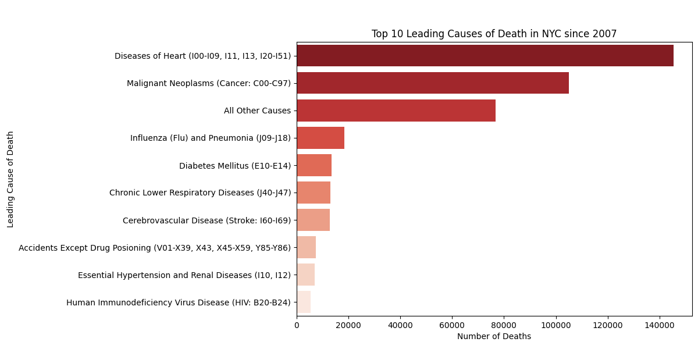
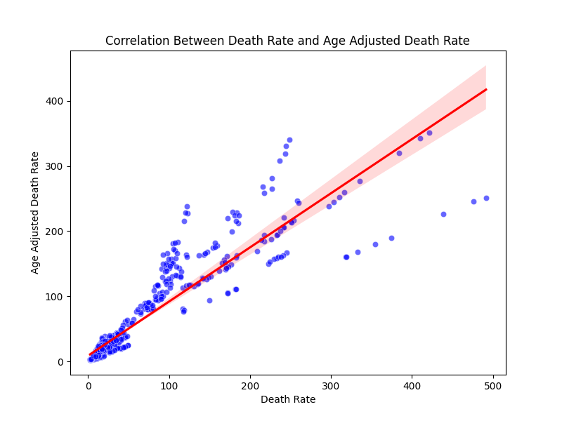

# Assignment 6

For this assignment, I decided to look at NYC's Leading Cause of Death. I used this data to answer the following questions:
- What are the top 10 leading causes of death in NYC?
- How do death rates vary by sex for the top causes?
- Is there a correlation between death rate and age-adjusted death rate?

[Code](assignment6code.py)

## What are the top 10 leading causes of death in NYC?

The three leading causes of death in NYC are:
- Heart Disease
- Malignant Neoplasms
- Influenza and Pneumonia

## How do death rates vary by sex for the top causes?

There is minimal variation between sex and the top causes of death. 

## Is there a correlation between death rate and age-adjusted death rate?

There is a strong positive correlation for this scatter plot, which means that as the Death rate increases, the Age-adjusted death rate also increases at a similar rate. This suggests that age distribution is not significantly distorting the death rates, and that the raw death rate data already gives a fairly accurate picture of mortality risk. This suggests that for most leading causes of death in NYC, mortality rates are relatively consistent across age groups. 

